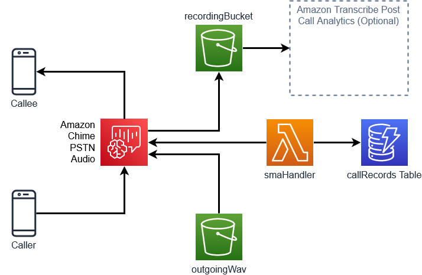

# Amazon Chime SIP Media Application On-Demand Recording

This demo will build and configure several services within AWS so that you can record and process calls through Amazon Chime SIP media application.

## Overview



## Requirements

- node V12+ [installed](https://nodejs.org/en/download/)
- npm [installed](https://www.npmjs.com/get-npm)
- yarn [installed](https://yarnpkg.com/getting-started/install)
- poetry [installed](https://python-poetry.org/docs/master/#installation)
- jq [installed](https://stedolan.github.io/jq/download/)
- AWS CLI [installed](https://docs.aws.amazon.com/cli/latest/userguide/install-cliv2.html)
- AWS CDK [installed](https://docs.aws.amazon.com/cdk/latest/guide/getting_started.html#getting_started_install)
  - `npm install -g aws-cdk`
  - Be sure to have the latest version installed. If you need to upgrade, uninstall with `npm uninstall -g aws-cdk` and then reinstall.
- AWS CDK [bootstrapped](https://docs.aws.amazon.com/cdk/latest/guide/bootstrapping.html)
  - `cdk bootstrap`
- Docker [installed](https://docs.docker.com/get-docker/)
- Deployment must be done in us-east-1
- SourcePhone - an E.164 number used as the primary number that will used as the primary phone number
- EmailSubscription - an email address that will be sent notifications from SNS

## Resources Created

- outboundWav S3 Bucket - Used for Amazon Chime SIP media application wav files
- recording S3 Bucket - Used for storage of raw recordings, transcriptions, and processed output
- triggerStepFunction Lambda - Lambda used to start the Step Function that will transcribe and process the audio file
- smaHandler Lambda - Lambda used by SIP media application to process calls
- transcribe Lambda - Triggered by S3 PutObject in the recordings folder of the recordings bucket. Start CallAnalyticsTranscribe Job
- createOutput Lambda - Triggered by EventBridge on completion of CallAnalytics Transcribe Job. Creates output file and sends link to SNS
- SNS Topic - Used to send notification by email of the output file
- SIP media application Resources
- - Phone Number - a number that can be called by SourcePhone number to dial out to PSTN, or by PSTN to dial to SourcePhone
- - SIP rule - a SIP media application rule that will trigger on the dialed number

## Deployment

- Clone this repo: `git clone https://github.com/aws-samples/amazon-chime-sma-on-demand-recording`
- `cd amazon-chime-sma-on-demand-recording`
- `./deploy.sh`
- Accept prompts for CDK deployment

### Cloud9 Deployment Instructions

```
nvm install 12
npm install -g aws-cdk
npm install -g yarn
curl -sSL https://raw.githubusercontent.com/python-poetry/poetry/master/install-poetry.py | python -
sudo yum install jq
./deploy.sh
```

## Description

This demo will demonstrate how to build and configure an Amazon Chime SIP media application that will allow a person to automatically record inbound and outbound calls. Once these calls have been completed, a transcription will be created and used to create a document that analyzes and formats that transcription. A link to this document is then sent to the primary user of this application.

## Using the Demo

After successfully deploying the CDK components, take note of the phone number in the output. This is the phone number that will be used by the application owner and external users. If the application owner calls this number from the source number provided during deployment, a prompt will be played to enter a phone number to be called. Once entered, that phone number will be called from the SIP media application. Once answered, a prompt will be played to the receiving party informing them that the call will be recorded. When the call ends and both parties have disconnected, a wav file is written to an S3 bucket. This PutObject starts the process of transcribing the audio and then creating the final output. A link to this file is then sent via email to the application owner to be downloaded.

Conversely, if anyone else dials the provided number, a prompt will be played informing the caller that the call will be recorded and then the application owner is called. Once completed, the same workflow as above will execute and produce a formatted transcript.

This example application could be used by a jouralist to aid in interviewing people and also mask their phone number by using an Amazon Chime SIP media application number for all calls. When they need to interview a person, simply calling this number will allow them to call any number they need to and ensure the call is recorded. Additionally, when they give this number out, they will know that calls will be routed to them and also recorded.

## How It Works

This application is comprosied of several components that work together without being strictly coupled to each other. The Amazon Chime SIP media application is the main entry point in either direction and will be used for the duration of the call. This SIP media application is controlled by the `smaHandler` Lambda function using an Invocation and Action response process described [here](https://docs.aws.amazon.com/chime/latest/dg/use-cases.html). All of the call routing logic is contained within this Lambda and makes use of the [`CallAndBridge action`](https://docs.aws.amazon.com/chime/latest/dg/call-and-bridge.html) to route calls from one user to another. This Lambda also starts the recording process by directing the output to an S3 bucket with the following action:

```
const startCallRecordingAction = {
    "Type": "StartCallRecording",
    "Parameters": {
      "ParticipantTag": "LEG-B",
      "Track": "BOTH",
      "Destination": {
        "Type": "S3",
        "Location": recordingBucket + "/recordings"
      }
    }
  }
```

Once the recording has been delivered to the S3 bucket, a Lambda is triggered from the PutObject event. This Lambda will trigger a Step Function to transcribe and process the transcription.

The transcription uses the [Amazon Transcribe Call Analytics](https://docs.aws.amazon.com/transcribe/latest/dg/call-analytics.html) feature and is called here:

```
    response = transcribe.start_call_analytics_job(
        CallAnalyticsJobName=str(uuid.uuid4()),
        Media={'MediaFileUri': "s3://" + bucket + "/" + key},
        DataAccessRoleArn=DATA_ACCESS_ROLE,
        OutputLocation="s3://" + bucket + "/transcriptions/" + output_key + ".json",
        ChannelDefinitions=[{'ChannelId': 0, 'ParticipantRole': 'AGENT'}, {
            'ChannelId': 1, 'ParticipantRole': 'CUSTOMER'}]
    )
```

Once the transcription is complete, the `createOutput` Lambda will be invoked by the Step Function to produce a document with the full turn by turn transcription along with other analytics. This Lambda makes use of the application described [here](https://github.com/aws-samples/amazon-transcribe-output-word-document) and uses an SNS topic to deliver the link to the created output file.

## Cleanup

To clean up this demo: `cdk destroy`. The S3 buckets that are created will be emptied and destroyed as part of this destroy so if you wish to keep the files, they should be moved prior to destroy.
